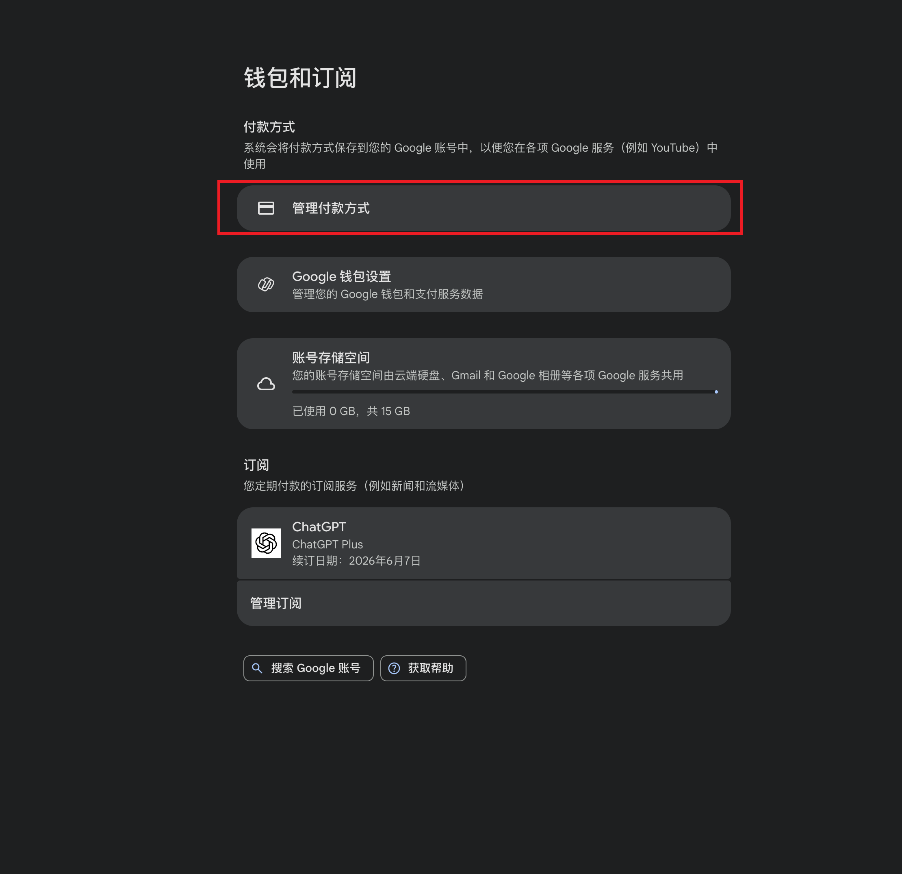
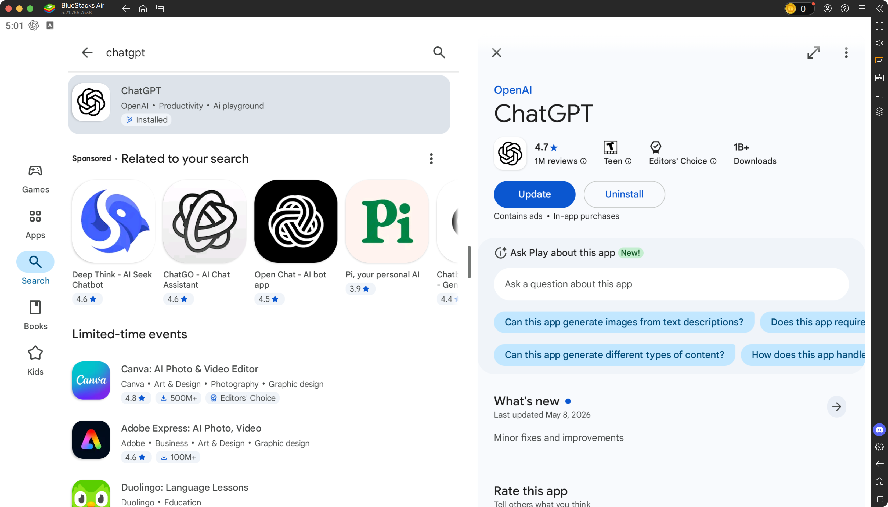

## 一、准备事项

开始之前，建议先准备好以下内容：

- 一个可以正常登录的 Google 账号
- 一张支持海外线上支付的 Visa 信用卡或借记卡
- 一台安卓手机，或一台可以安装安卓模拟器的电脑
- 一个可以正常登录的 ChatGPT 账号

## 二、进入 Google 账号付款页面

在浏览器中打开 Google 账号的付款与订阅页面：

[https://myaccount.google.com/payments-and-subscriptions?utm_source=chrome-profile-chooser](https://myaccount.google.com/payments-and-subscriptions?utm_source=chrome-profile-chooser)

登录 Google 账号后，进入 **钱包和订阅** 页面，找到 **付款方式** 区域，然后点击 **管理付款方式**。

## 三、绑定 Visa 卡

进入付款方式管理页面后，选择添加新的银行卡，并填写 Visa 卡信息。

填写时需要注意：

- 持卡人姓名应与银行卡信息一致
- 卡号、有效期、CVV 按银行卡实际信息填写
- 账单地址从  [https://usaddressgen.com/tax-free-address/](https://usaddressgen.com/tax-free-address/) 美国免税州复制随机地址，可以免去税费
- 如果支付失败，可以检查银行卡是否开启了境外线上支付权限

绑定成功后，回到 Google 付款方式页面，确认该卡已经保存到当前 Google 账号中。

## 四、准备 ChatGPT App

完成 Google 付款方式绑定后，需要通过安卓环境安装 ChatGPT App。

### 4.1 使用安卓手机

如果你有安卓手机，可以直接打开 **Google Play 商店**，搜索并安装 **ChatGPT**。

安装时请确认应用信息：

- 应用名称：ChatGPT
- 开发者：OpenAI

### 4.2 使用 BlueStacks 模拟器

如果没有安卓手机，可以在电脑上安装 BlueStacks 安卓模拟器。

BlueStacks 下载地址：

[https://www.bluestacks.com/](https://www.bluestacks.com/)

安装完成后，按下面的步骤操作：

1. 打开 BlueStacks
2. 登录前面绑定过 Visa 卡的 Google 账号
3. 打开 Google Play 商店
4. 搜索 `ChatGPT`
5. 下载 OpenAI 官方 ChatGPT App

## 五、在 Google Play 下载 ChatGPT

在 Google Play 商店中搜索 `ChatGPT`，进入 OpenAI 官方应用页面。

如果页面显示 **安装**，点击安装即可。  
如果页面显示 **打开** 或 **更新**，说明应用已经安装，可以直接打开或先更新到最新版本。

## 六、登录并升级会员

打开 ChatGPT App 后，按照以下流程订阅：

1. 登录你的 ChatGPT 账号
2. 进入账号、设置或订阅页面
3. 选择需要升级的会员方案
4. 确认 Google Play 弹出的订阅付款信息
5. 使用已经绑定的 Visa 卡完成支付

支付成功后，返回 ChatGPT App，确认会员状态是否已经生效。

## 七、常见问题

### 7.1 Google 绑定银行卡失败怎么办？

可以优先检查下面几项：

- Visa 卡是否支持海外线上支付
- 银行卡是否开启境外支付权限
- 账单地址是否与付款方式信息一致
- Google 账号是否存在付款资料异常或风控限制

### 7.2 Google Play 搜不到 ChatGPT 怎么办？

可能与 Google Play 账号地区、设备环境或网络环境有关。建议确认：

- Google Play 是否已经正常登录
- 当前网络是否稳定
- 搜索结果中的应用开发者是否为 OpenAI
- 当前 Google Play 环境是否支持显示该应用

### 7.3 账单地址怎么填更稳妥？

建议按下面的顺序确认：

- 优先以银行卡发卡行登记的账单地址为准
- 持卡人姓名、卡号、账单地址尽量保持一致
- 如果不确定发卡行预留地址，先联系银行客服确认
- 不要使用地址生成器、代填地址或所谓“免税州地址”进行尝试

### 7.4 订阅成功但会员没有生效怎么办？

可以尝试：

- 退出并重新登录 ChatGPT App
- 等待几分钟后刷新订阅状态
- 在 Google Play 的订阅页面确认付款是否成功
- 联系 Google Play 或 OpenAI 官方支持

## 八、注意事项

- 不要在非官方渠道购买所谓低价会员或代充服务
- 订阅扣费、退款和取消订阅通常由 Google Play 管理
- 会员权益和可用功能以 ChatGPT App 内实际展示为准
